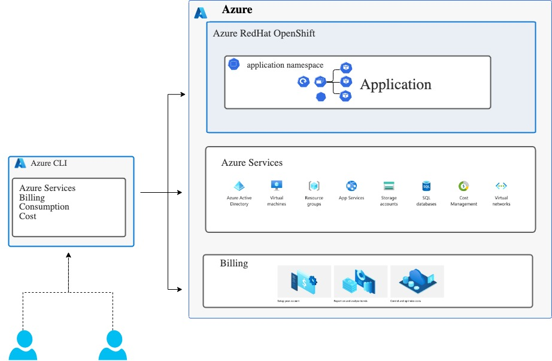

# Azure-utilities
Utilities requried for retrieving Azure cloud billing, cost as well as scripts for cleaning up resources such as storage, virtual machines, apps, dashboards, services, or almost anything you deal with in Azure.



## Caution!

Be aware that *DeleteResourceGroup.sh* is a very destructive tool, be very careful while using it. Otherwise you might delete production data. **Do NOT run this application on an Azure Cloud account where you cannot afford to lose all resources.**

## Install CLI 

The Azure CLI is available to install in Windows, macOS and Linux environments. It can also be run in a Docker container and Azure Cloud Shell.

Refer the install instructions for Azure CLI - https://docs.microsoft.com/en-us/cli/azure/install-azure-cli

## Azure CLI Sign in interactively
For this release, we are using Azure CLI's default authentication method for logins uses a web browser and access token to sign in.


## CLI options

| Category | Name                                                                       | Description          | Run Time |
|--------|----------------------------------------------------------------------------|----------------------|----------|
| Retrieve    | [List Account](./listaccount.sh)    | Retrieve Account Details       | 2 Mins   |
| Retrieve    | [List All Resource Group ](./listallresourcegroup.sh)    | List ALL resource group might contain storage, virtual machines, apps, dashboards, services, or almost anything you deal with in Azure.       | 2 Mins   |
| Retrieve    | [List All Resource based on location ](./listallresources-location.sh)    | List Azure resources based on location| 2 Mins   |
| Retrieve    | [List All Resource based on tag ](./listallresources-tag.sh)    | List Azure resources based on tag| 2 Mins   |
| Retrieve    | [List All Resource based on Resource Group ](./listallresources-resourcegroup.sh)    | List Azure resources based on specific resource group| 2 Mins   |
| Retrieve    | [List the entire set of tags for a subscription](./listalltags-subscription.sh)    | List Azure resources tags based on a subscription| 2 Mins   |
| Retrieve    | [List the consumption usage for range between start and end date](./listconsumptionusage-daterange.sh)    | List the details of Azure resource consumption within a billing period| 2 Mins   |
| Delete    | [Delete Resource Group](./deleteresourcegroup.sh) |⚠️⚠️⚠️⚠️ Delete resource group will remove storage, virtual machines, apps, dashboards, services, or almost anything you deal with in Azure | 10-30 Mins (Depends on total number of resources)  |

## Using the CLI

### 1. Clone the repo.

   ```bash
   git clone https://github.com/cloud-native-toolkit/azure-utilities.git
   ```


### 2.CLI Usage with parameters

   ##### List Accounts
   ```bash
   ./listaccount.sh
   ```

   ##### List all resource group in Azure Subscription
   ```bash
   ./listresourcegroup.sh
   ```

   ##### List all resources based on particular location
   ```bash
   ./listallresources-location.sh {Location name such as eastus}
   ```
   
   ##### List all resources based on tag
   ```bash
   ./listallresources-tag.sh {tag name such as default}
   ```
   
   ##### List all resources based on particular resource group
   ```bash
   ./listallresources-resourcegroup.sh {Resource group name such as bala-rg}
   ```

   ##### List all tags based on subscription id
   ```bash
   ./listalltags-subscription.sh {Subscription id for account}
   ```

   ##### List consumption usage based on the start date and end date
   ```bash
   ./listconsumptionusage-daterange.sh {startdate enddate billingperiodname}
   ```
    **Example** - ./listconsumptionusage-daterange.sh 2022-06-26 2022-06-27 June
   
   ##### Delete Resource Group (including all resources in resource group)

   ⚠️⚠️⚠️⚠️**Do NOT run this - All resources gone in Azure Cloud**

   ```bash
   ./deleteresourcegroup {ResourceGroup}
   ```
   
## TODO

1. Need to use service principal instead of user with MFA
2. The project needs support for deleting the following types of resources:
   - Tag
   - Location
   - Tesourcegroup
3. The project needs support for deleting with skipping certain resources.
4. The project needs support for retrieving costmanagement, billing & invoices.

## References
- [Manage Resource Group](https://docs.microsoft.com/en-us/azure/azure-resource-manager/management/manage-resource-groups-cli)
- [Manage Resources](https://docs.microsoft.com/en-us/azure/azure-resource-manager/management/manage-resources-cli)
- [Billing + Cost Management](https://docs.microsoft.com/en-us/cli/azure/service-page/azure%20cost%20management%20+%20billing?view=azure-cli-latest)